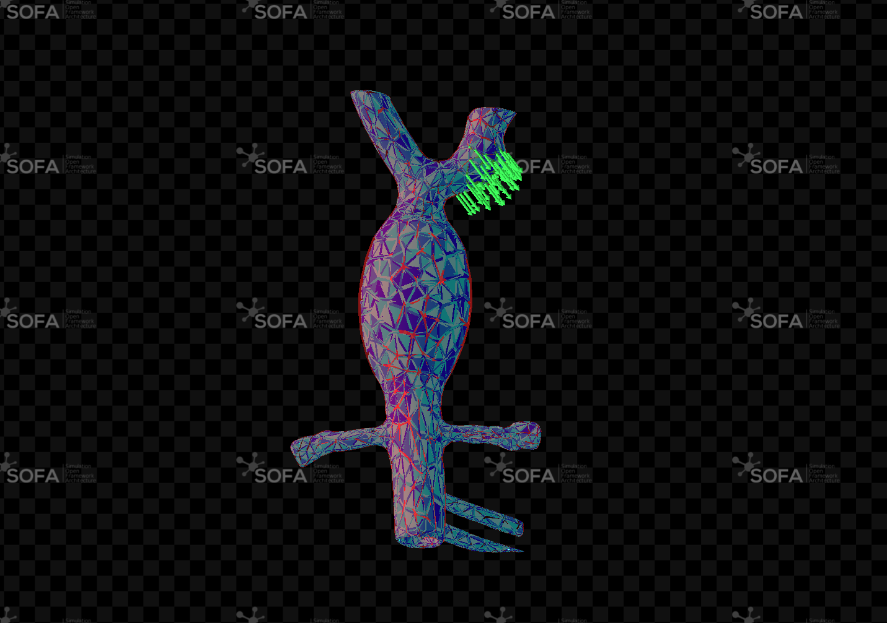

# A simulation environment for robot-assisted endovascular interventions


This repository contains physics-based simulation scenarios for robot-assisted endovascular interventions built using the SOFA Framework. 
The code is part of the work published in [Pescio, M., Li, C., Kundrat, D. et al. A simulation environment for robot-assisted endovascular interventions. Int J CARS 20, 2259–2267 (2025)](https://link.springer.com/article/10.1007/s11548-025-03458-2)

[SOFA](https://github.com/sofa-framework/sofa) is an open-source framework for real-time multi-physics simulation, with strong support for deformable models, collision, constraints, and medical simulation workflows. This project also uses the [BeamAdapter](https://github.com/sofa-framework/BeamAdapter) plugin, which provides beam and Kirchhoff-rod based models for flexible 1D structures such as catheters and guidewires.

## Getting Started

If you are new to SOFA, the [official documentation](https://sofa-framework.github.io/doc/) is the best starting point.

To test the code of this repository:

1. Install the latest SOFA binaries ([v25.12.00](https://www.sofa-framework.org/download/))
2. Add the SOFA ```bin``` folder to your ```PATH```: 
   ```
   echo 'export PATH="$PATH:YOUR_PATH/SOFA/bin"' >> ~/.bashrc
   source ~/.bashrc
   ```
3. Test the installation:
    ```
    runSofa
    ```
4. Clone this repository:
    ```
    git clone https://github.com/matteopescio/A-simulation-environment-for-endovascular-interventions.git
    ```

## Project Content

The repository provides two main SOFA entry points:

- `forces.py`: deformable abdominal aortic aneurysm phantom with an ROI force loading interface for force/displacement sensing.
- `catheter.py`: deformable abdominal aorta phantom with a single catheter for insertion simulation.

## Force And Shape Sensing Scenario

Run:

```bash
runSofa forces.py
```


The force scene loads the `AbdominalAorticAneurysm` tetrahedral mesh and lets the user apply a constant force to a BoxROI. 



Select a FEM model:

```bash
runSofa forces.py --argv "--fem Elastic"
runSofa forces.py --argv "--fem Ogden"
runSofa forces.py --argv "--fem Mooney-Rivlin"
runSofa forces.py --argv "--fem Neo-Hookean"
```

The control panel provides:

- ROI force intensity slider.
- `Record Displacement` / `Stop Recording` button.

Recorded files are written to:

```text
data/forces_FEMTYPE_YYYYMMDD_HHMMSS.csv
```

## Catheter Insertion Scenario


The catheter scene loads the simplified `AbdominalAorta` mesh and inserts one catheter modeled with BeamAdapter components. The scene keeps the vessel deformable and uses collision/constraint response and a centerline-based virtual fixture to guide the device inside the phantom.

Run:

```bash
runSofa catheter.py
```

The control panel provides:

- Catheter insertion speed slider in `mm/s`.
- Catheter rotation slider.
- `Start Insertion` / `Stop Insertion`.
- `Catheter Reset`.
- `Record Insertion` / `Stop Recording`.

Recorded files are written to:

```text
data/catheter_YYYYMMDD_HHMMSS.csv
```

The catheter CSV includes insertion speed, insertion length, rotation, tip position, tip orientation, tip-wall force, force modulus, and tip-target distance.

## Repository Layout

```text
Endovascular/
  catheter.py                  # Main catheter insertion scene
  forces.py                    # Main force/displacement scene
  data/                        # Example and recorded CSV files
  media/                       # Files for documentation
  meshes/                      # STL/MSH geometry and FEM meshes
  scripts/                     # Shared SOFA scene implementation
```

## Citing

If you use the project in your work, please consider citing with:

```bibtex
@article{pescio2025simulation,
  title={A simulation environment for robot-assisted endovascular interventions},
  author={Pescio, Matteo and Li, Chenhao and Kundrat, Dennis and Casadio, Maura and Dagnino, Giulio},
  journal={International journal of computer assisted radiology and surgery},
  pages={1--9},
  year={2025},
  publisher={Springer}
}
```
