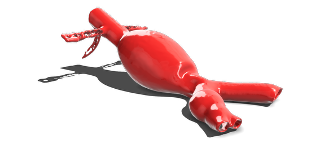
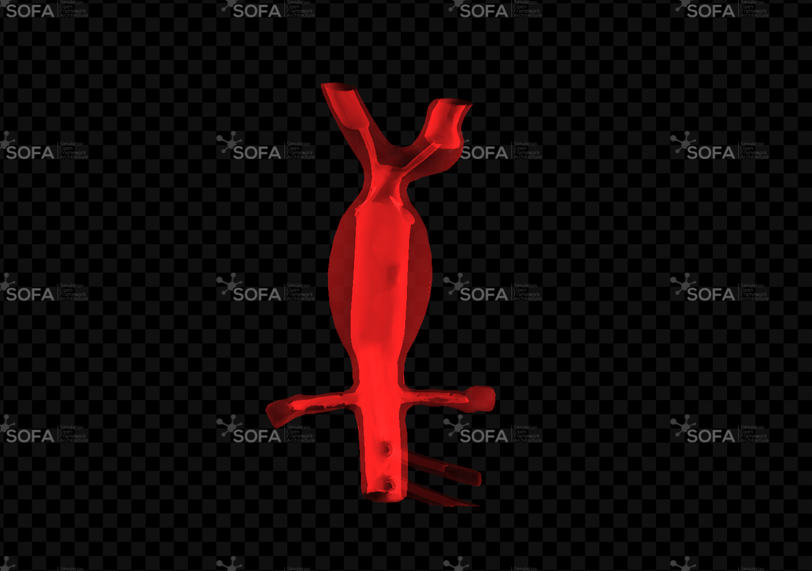
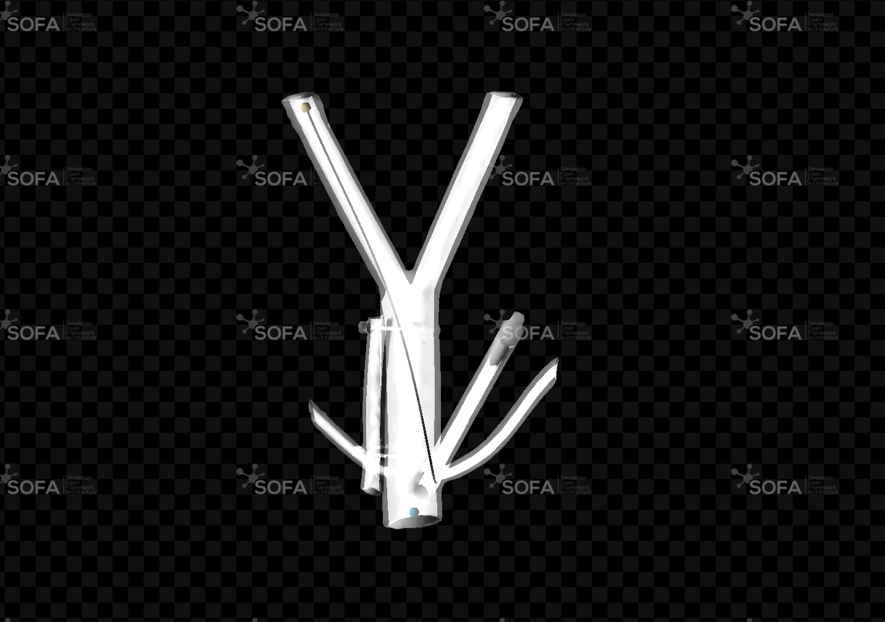

# A simulation environment for robot-assisted endovascular interventions



This repository contains SOFA scenes for robot-assisted endovascular intervention simulation. The code accompanies the work published in **"A simulation environment for robot-assisted endovascular interventions"**:

https://link.springer.com/article/10.1007/s11548-025-03458-2

[SOFA](https://github.com/sofa-framework/sofa) is an open-source framework for real-time multi-physics simulation, with strong support for deformable models, collision, constraints, and medical simulation workflows. This project also uses the [BeamAdapter](https://github.com/sofa-framework/BeamAdapter) plugin, which provides beam and Kirchhoff-rod based models for flexible 1D structures such as catheters and guide-like devices.

For installation, use the latest SOFA binaries from the official download page:

https://www.sofa-framework.org/download/

If you are new to SOFA, the official documentation is the best starting point:

https://sofa-framework.github.io/doc/

## Project Content

The repository provides two main SOFA entry points:

- `forces.py`: deformable abdominal aortic aneurysm phantom with an ROI force loading interface for force/displacement studies.
- `catheter.py`: deformable abdominal aorta phantom with a single J-shaped BeamAdapter catheter for insertion experiments.

The shared implementation is in `scripts/`. Meshes are in `meshes/`, example CSV outputs are in `data/`, and figures used in this README are in `figures/`.

## Force And Shape Sensing Scenario


The force scene loads the `AbdominalAorticAneurysm` tetrahedral mesh and lets the user apply a constant force to a BoxROI. The selected ROI nodes are recorded as displacement signals, together with the force modulus, so the resulting CSV can relate applied force to measured deformation.



Run:

```bash
runSofa forces.py
```

Select a FEM model:

```bash
runSofa forces.py --argv "--fem Elastic"
runSofa forces.py --argv "--fem Ogden"
runSofa forces.py --argv "--fem Mooney-Rivlin"
runSofa forces.py --argv "--fem Neo-Hookean"
```

The control panel provides:

- ROI force intensity slider.
- `Record Displacement` / `Stop Recording` button.

Recorded files are written to:

```text
data/forces_FEMTYPE_YYYYMMDD_HHMMSS.csv
```

## Catheter Insertion Scenario



The catheter scene loads the simplified `AbdominalAorta` mesh and inserts one J-shaped catheter modeled with BeamAdapter components. The scene keeps the vessel deformable and uses collision/constraint response and a centerline-based virtual fixture to guide the device inside the phantom.

Run:

```bash
runSofa catheter.py
```

The control panel provides:

- Catheter insertion speed slider in `mm/s`.
- Catheter rotation slider.
- `Start Insertion` / `Stop Insertion`.
- `Catheter Reset`.
- `Record Insertion` / `Stop Recording`.

Recorded files are written to:

```text
data/catheter_YYYYMMDD_HHMMSS.csv
```

The catheter CSV includes insertion speed, insertion length, rotation, tip position, tip orientation, tip-wall force, force modulus, and tip-target distance.

## Repository Layout

```text
Endovascular/
  catheter.py                  # Main catheter insertion scene
  forces.py                    # Main force/displacement scene
  data/                        # Example and recorded CSV files
  figures/                     # Images for documentation
  meshes/                      # STL/MSH geometry and FEM meshes
  scripts/                     # Shared SOFA scene implementation
```

## Notes

- The scenes are written for SOFA Python scenes and should be launched with `runSofa`.
- The code assumes that the BeamAdapter plugin is available in the SOFA installation.
- Paths are resolved relative to this repository, so the code does not depend on a local hardcoded SOFA installation path.
